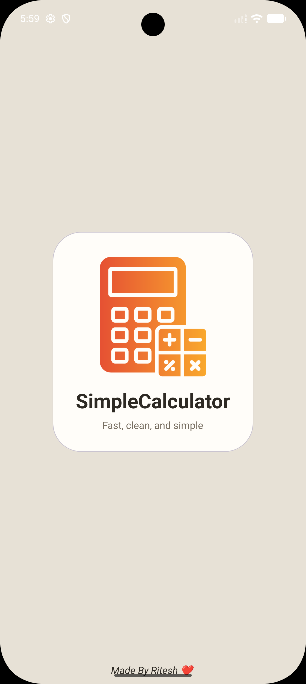
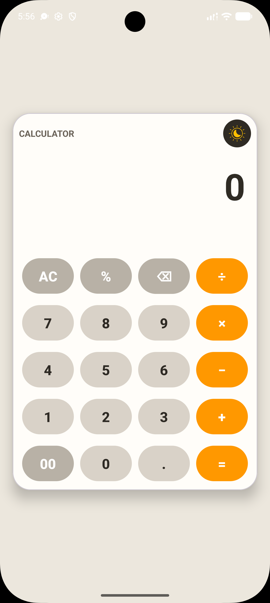
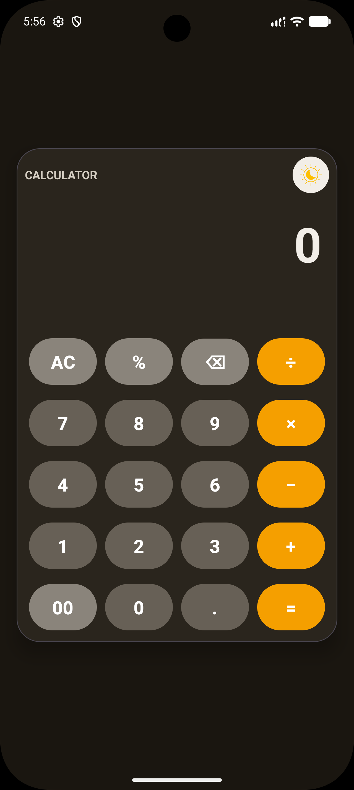

# SimpleCalculator

A clean Android calculator app built with Kotlin, XML, and ViewBinding.  
It includes a splash screen, dark/light theme support, and a calculator UI inspired by the modern phone calculator style.

## Features

- Splash screen with app logo and footer
- Dark and light theme toggle
- Calculator operations: `+`, `-`, `×`, `÷`
- Extra actions: `AC`, `%`, `00`, backspace, decimal, equals
- Live preview result below the main expression
- Custom app icon and theme toggle icon

## Screenshots

### Splash Screen



### Calculator - Light Theme



### Calculator - Dark Theme



## Tech Stack

- Kotlin
- XML layouts
- ViewBinding
- Material Components
- AndroidX

## Requirements

- Android Studio
- JDK 11 or higher
- Android SDK 24+

## Project Setup

1. Clone the repository.
2. Open it in Android Studio.
3. Let Gradle sync complete.
4. Run the app on an emulator or physical device.

## How It Works

- `SplashActivity` is the launcher activity.
- After a short delay, it opens `MainActivity`.
- `MainActivity` handles the calculator input state and updates the result preview in real time.
- Theme preference is stored locally and restored on app launch.

## Project Structure

```text
app/src/main/java/com/example/simplecalculator/
├── AppTheme.kt
├── MainActivity.kt
└── SplashActivity.kt

app/src/main/res/
├── drawable/
├── layout/
├── mipmap-*/
├── values/
└── values-night/
```

## Notes

- The app uses ViewBinding instead of `findViewById`.
- The launcher icon and splash artwork use the provided calculator image.
- The footer text on the splash screen shows `Made By Ritesh ❤️`.

## License

No license has been added yet. Add one if you plan to publish or share the project publicly.
